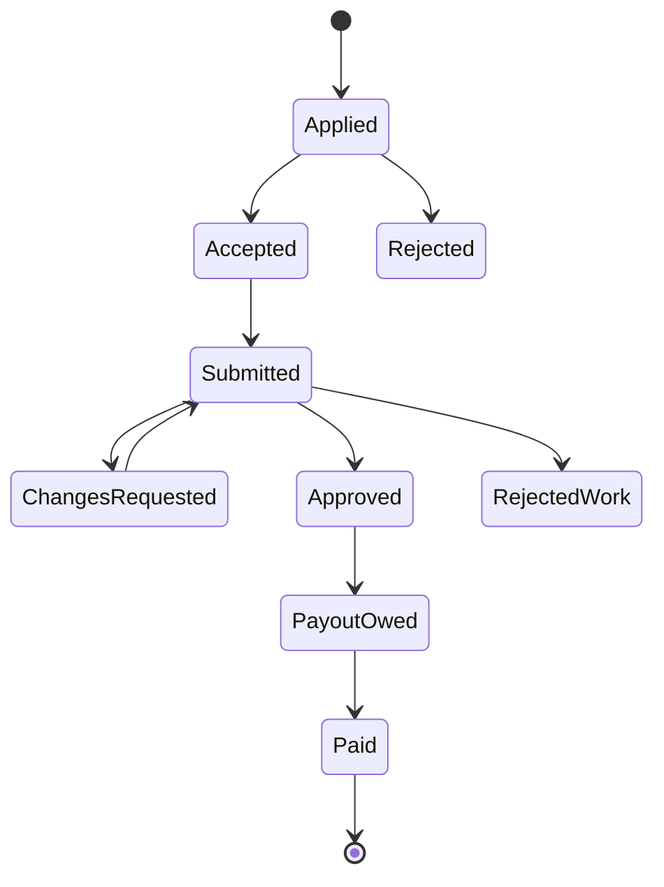

# Database schema

Sixteen tables cover the whole MVP. Money is stored in cents as integers, and every
table has `id` (uuid) and `created_at`.

| Table              | Key fields                                                                                                                                                                                           | Notes                                         |
| ------------------ | ---------------------------------------------------------------------------------------------------------------------------------------------------------------------------------------------------- | --------------------------------------------- |
| profiles           | user_id, role (talent/admin), full_name, username, avatar_url, country, date_of_birth, bio, phone                                                                                                    | One per auth user; signup blocked under 18    |
| payout_details     | user_id, method (bank/juice/wise/paypal), details (json)                                                                                                                                             | Readable only by the owner and admins         |
| companies          | name, slug, logo_url, description, website                                                                                                                                                           | Admin-managed; the 4 launch companies         |
| skills             | slug, name, description                                                                                                                                                                              | e.g. clipping, cold_calling, content, web_dev |
| user_skills        | user_id, skill_id, source (course/manual), awarded_by                                                                                                                                                | These are the badges                          |
| jobs               | company_id, title, description, category, pay_cents, pay_type (fixed/per_unit), unit_label, max_units, slots, required_skill_id (nullable), deadline, proof_instructions, status (draft/open/closed) | required_skill_id empty = open to all         |
| applications       | job_id, user_id, pitch, status (pending/accepted/rejected/withdrawn)                                                                                                                                 | Unique per job + user                         |
| submissions        | application_id, notes, links[], file_paths[], units_claimed, status (submitted/changes_requested/approved/rejected), reviewer_note                                                                   | Proof of work                                 |
| payouts            | user_id, submission_id, amount_cents, status (owed/paid), method, reference, paid_at                                                                                                                 | Created on approval, marked paid by admin     |
| conversations      | application_id                                                                                                                                                                                       | One chat thread per accepted job              |
| messages           | conversation_id, sender_id, body, attachment_path, read_at                                                                                                                                           | Realtime enabled                              |
| notifications      | user_id, type, title, body, link, read_at, emailed_at                                                                                                                                                | Bell icon + email                             |
| courses            | slug, title, description, price_cents, skill_id, lemon_variant_id, published                                                                                                                         | Passing awards skill_id                       |
| lessons            | course_id, position, title, body_md, video_id                                                                                                                                                        | Ordered lessons                               |
| course_access      | user_id, course_id, order_id, amount_cents                                                                                                                                                           | Created by payment webhook                    |
| course_assignments | user_id, course_id, notes, links[], file_paths[], status (pending/passed/failed), feedback, graded_by                                                                                                | Manual grading                                |

## Job states (per worker)

Every arrow sends a notification to the other side.

## Payout amount on approval

- fixed job: `pay_cents`
- per_unit job: `pay_cents * min(units_approved, max_units)`
